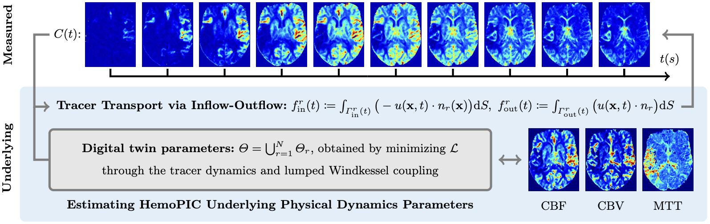
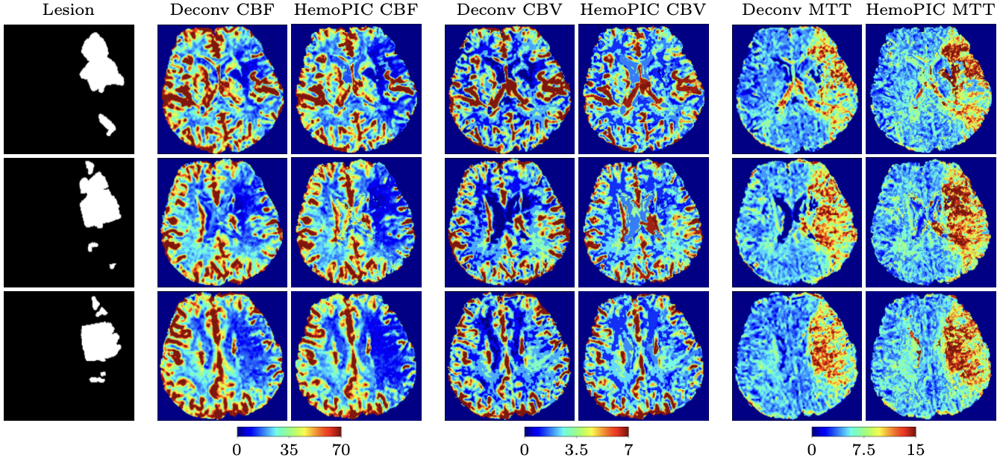

<div align="center">
  <h1>HemoPIC<br><sub>A Physics-Informed Cerebral Hemodynamics Digital Twin for Brain Perfusion</sub></h1>
</div> 

<p align="center">
  <a href="https://arxiv.org/abs/2607.08799">arXiv preprint</a> | <a href="https://papers.miccai.org/miccai-2026/0453-Paper2058.html">MICCAI 2026</a> (Oral)
</p>

<p align="center">
<b align="center">Yi-Chen Lee</b> and <b align="center">Peirong Liu</b>
</p>

<p align="center">
Department of Electrical and Computer Engineering,<br/>
Data Science and AI Institute,<br/>
Johns Hopkins University
</p>

<p align="center">
Contact: {ylee268, pliu53}@jh.edu
</p>

This repository contains the official implementation of our **MICCAI 2026** paper **HemoPIC: A Physics-Informed Cerebral Hemodynamics Digital Twin for Brain Perfusion**. It includes a complete pipeline and evaluation scripts for cerebral perfusion processing.

<p align="center">
  
  <br>
  <em>
  <strong>Fig. 1. Overview of HemoPIC.</strong> Given measured tracer dynamics, HemoPIC estimates regional blood inflow and outflow without requiring an arterial input function (AIF). It couples tracer transport with patient-specific hemodynamics in a physics-grounded formulation.
  </em>
</p>

<p align="center">
  
  <br>
  <em>
  <strong>Fig. 2. Consistency between HemoPIC and conventional AIF-based perfusion maps.</strong> Deconv denotes the ISLES 2017 silver-standard AIF-based deconvolution maps. All maps are shown using identical scales for each parameter.
  </em>
</p>

## Installation

Requires Python 3.9 or later.

```bash
pip install -r requirements.txt
```

## Execution order

1. **Preprocessing 1** — build the HemoPIC tissue partition (`hemopic_seg4`)
2. **Preprocessing 2** — convert PWI signal to tracer concentration
3. **Step 1** — run HemoPIC fitting (`scripts/run_hemopic.py`)
4. **Step 2** — run evaluation scripts in `Eval/`

Use the bundled demo to skip preprocessing and Step 1 fitting; see [Demo](#demo) below.

## Demo

A running demo for **patient 22** (manuscript example) is included in [`assets/example/`](assets/example/), with inputs and precomputed HemoPIC outputs. From the repository root:

```bash
python scripts/run_demo.py --eval          # Step 2: slice maps (z = 13, 14, 15)
python scripts/run_demo.py --fit           # Step 1: rerun fitting
python scripts/run_demo.py --fit --eval    # both steps
```

See [`assets/example/README.md`](assets/example/README.md) for the bundled file layout.

## Data

This repository uses the [ISLES 2017](https://zenodo.org/records/17736412) Training set. Provide the path to the `ISLES2017_Training` folder as `DATASET_ROOT` in all commands.

Each `training_XX/` folder should contain:

- `MR_rCBF`, `MR_rCBV`, `MR_MTT` — silver-standard perfusion maps
- `CTC_from_MR_4DPWI` — tracer concentration time series (from Preprocessing 2)
- `hemopic_seg4/seg4_label_ref24.nii.gz` — HemoPIC tissue partition (from Preprocessing 1; required)
- `hemopic_seg4/seg4_gray_ref24.nii.gz` — gray overlay of the partition (from Preprocessing 1; optional)
- `OT` — lesion mask (optional; used by some evaluation scripts)

## Preprocessing 1 (HemoPIC Partition)

This step builds the HemoPIC tissue partition: a four-class label map (gray matter, white matter, CSF/ventricles, brain stem) resampled to the perfusion grid. For each subject it writes:

```
training_XX/hemopic_seg4/seg4_label_ref24.nii.gz
training_XX/hemopic_seg4/seg4_gray_ref24.nii.gz
```

under `DATASET_ROOT`.

```bash
python preprocess/Segmentation/hemopic_seg4.py \
  /path/to/ISLES2017_Training \
  /path/to/segmentation_root
```

`segmentation_root` should contain per-subject structural segmentations. For ISLES 2017, you can generate these with the helper script below (requires [FreeSurfer](https://surfer.nmr.mgh.harvard.edu/) installation):

```bash
export FREESURFER_HOME=<path to your freesurfer install>
source "$FREESURFER_HOME/SetUpFreeSurfer.sh"
export FS_LICENSE=<path to your license.txt>

python preprocess/Segmentation/run_synthseg.py \
  /path/to/ISLES2017_Training \
  /path/to/segmentation_root
```

Pass the same `segmentation_root` to `hemopic_seg4.py`. To process one subject, append `training_36` to either command.

## Preprocessing 2 (PWI to Tracer Concentration)

This step converts the raw ISLES 2017 perfusion-weighted imaging signal into `CTC_from_MR_4DPWI`, the tracer time series used by Step 1.

Run for all patients:

```bash
python preprocess/signal_to_concentration/pwi_to_tracer.py \
  /path/to/ISLES2017_Training \
  1 48
```

## Step 1: HemoPIC Pipeline

```bash
DATASET_ROOT=/path/to/ISLES2017_Training
OUT_ROOT=/path/to/HemoPIC_outputs
PATIENT_NUM=<PATIENT_NUM>
K_GM=8
K_WM=6
SEED=0

python scripts/run_hemopic.py "$DATASET_ROOT" "$OUT_ROOT" "$PATIENT_NUM" "$K_GM" "$K_WM" "$SEED"
```

Notes:

- `OUT_ROOT` is the output folder produced by HemoPIC.
- Fitting writes to `OUT_ROOT/training_XX/` (e.g. `HemoPIC_CBF.nii.gz`, `roi_fit_summary.csv`).
- Use `OUT_ROOT` as `FIT_ROOT` in the Step 2 commands below.

## Step 2: Evaluation

Shared arguments:

```bash
DATASET_ROOT=/path/to/ISLES2017_Training
FIT_ROOT=/path/to/HemoPIC_outputs
OUT_DIR=/path/to/HemoPIC_eval
```

### Central Volume Theorem Verification

```bash
python Eval/cvt_check/run_eval_cvt.py "$DATASET_ROOT" "$FIT_ROOT" "$OUT_DIR"
```

### Slice Maps for Visualization

```bash
python Eval/summary_maps/run_eval_slice_maps.py \
  "$DATASET_ROOT" \
  "$FIT_ROOT" \
  "$OUT_DIR" \
  <patient_id> <slice_z> <cbf_max> <cbv_max> <mtt_max>
```

Notes:

- Manuscript example: `patient_id = 22`, `slice_z = 13, 14, 15` (one slice per run), `cbf_max = 70`, `cbv_max = 7`, `mtt_max = 15`.
- Or use `python scripts/run_demo.py --eval` with the bundled demo data.

### Summary Statistics

```bash
python Eval/summary_maps/run_eval_summary_stats.py "$DATASET_ROOT" "$FIT_ROOT" "$OUT_DIR"
```

### Tracer Reconstruction Results

```bash
python Eval/tracer_recon/run_eval_tracer_estimation.py "$DATASET_ROOT" "$FIT_ROOT" "$OUT_DIR"
```

### Windkessel Parameters Report

```bash
python Eval/Windkessel/run_eval_tau_report.py "$DATASET_ROOT" "$FIT_ROOT" "$OUT_DIR"
```

### Lesion ROC / PR Analysis

Compare HemoPIC and ISLES silver-standard maps for OT lesion discrimination (CBF, CBV, MTT):

```bash
python Eval/lesion_roc/run_eval_lesion_roc.py "$DATASET_ROOT" "$FIT_ROOT" "$OUT_DIR/lesion_roc" --all
```

## Link to Manuscript

- **`Eval/summary_maps/run_eval_summary_stats.py`** — patient cohort summary statistics for lesion and gray/white matter
- **`Eval/summary_maps/run_eval_slice_maps.py`** — qualitative slice map figures for selected patients and slices
- **`Eval/tracer_recon/run_eval_tracer_estimation.py`** — tracer reconstruction evaluation reports and plots
- **`Eval/cvt_check/run_eval_cvt.py`** — central volume theorem consistency summaries and plots
- **`Eval/Windkessel/run_eval_tau_report.py`** — Windkessel parameter reports
- **`Eval/lesion_roc/run_eval_lesion_roc.py`** — lesion ROC/PR analysis for CBF, CBV, and MTT

## Citation

```bibtex
@inproceedings{lee2026hemopic,
  title={{HemoPIC: A Physics-Informed Cerebral Hemodynamics Digital Twin for Brain Perfusion}},
  author={Lee, Yi-Chen and Liu, Peirong},
  booktitle={Medical Image Computing and Computer Assisted Intervention (MICCAI)},
  year={2026}
}
```

## Copyright

"HemoPIC: A Physics-Informed Cerebral Hemodynamics Digital Twin for Brain Perfusion" is a publication of The Johns Hopkins University and copyright © 2026 The Johns Hopkins University. All rights reserved.
